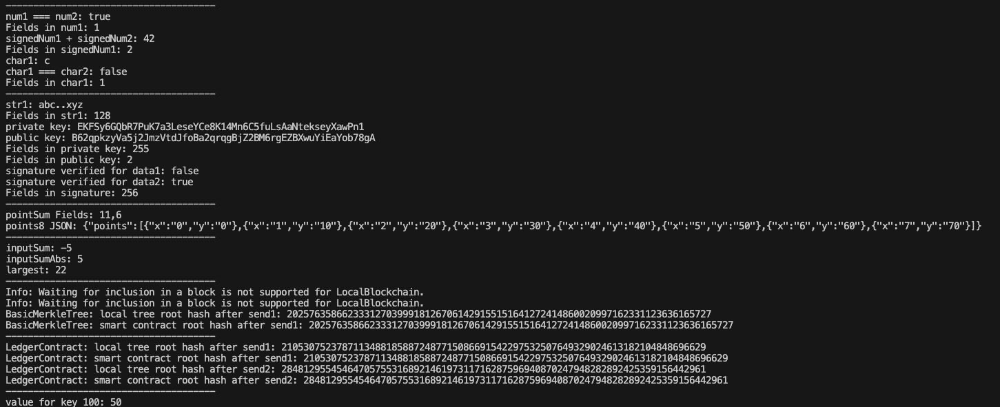

# zkApp: 05 Common Types And Functions

This tutorial helps you learn about types you can use when building with o1js. Earlier tutorials mostly use the `Field` type. o1js provides other higher-order types built from Fields that are useful for zkApp development and expand the possibilities for more applications.

## Version
- o1js: **0.15.2**

## Tutorial

For the step-by-step tutorial, see [Tutorial 5: Common Types And Functions](https://docs.minaprotocol.com/zkapps/tutorials/common-types-and-functions).

## How to install and run this example project

1. Clone the repository:
    ```sh
    git clone https://github.com/o1-labs/docs2.git
    ```
2. Change directory to the project location:
    ```sh
    cd docs2/examples/zkapps/05-common-types-and-functions
    ```
3. Install dependencies:
    ```sh
    npm install
    ```

4. Build the project:
    ```sh
    npm run build
    ```

5. Run the compiled code:
    ```sh
    node build/src/main.js
    ```
    To run and build the compiled code with a single command:
    ```sh
    npm run build && node build/src/main.js
    ```

## Expected output


## Last audit date
 
**22-January-2024**

## License

[Apache-2.0](LICENSE)
