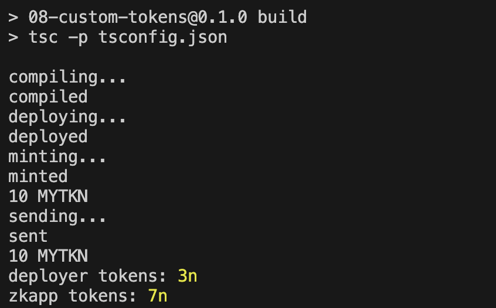
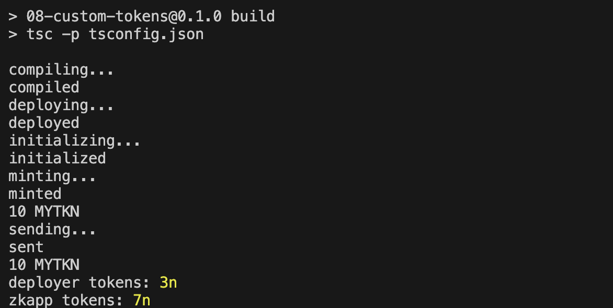

# Mina zkApp: 08 Custom Tokens

This Custom Token tutorial helps you to learn to create custom tokens.

## Version:
- o1js: **0.15.3**

## Tutorial

For the step-by-step tutorial, see [Tutorial 8: Custom Tokens](https://docs.minaprotocol.com/zkapps/tutorials/custom-tokens).

## How to install & run this example project:

1. Clone the repository:
    ```sh
    git clone https://github.com/o1-labs/docs2.git
    ```
2. Change Directory to project location:
    ```sh
    cd docs2/examples/zkapps/08-custom-tokens
    ```
3. Install dependencies:
    ```sh
    npm install
    ```

4. Build the project:
    ```sh
    npm run build
    ```

5. Run the compiled code:
    ```sh
    node build/src/main.js
    ```

    ```sh
    node build/src/mainWhitelist.js
    ```

    ### OR
   
    Build & Run code:

    ```sh
    npm run build && node build/src/main.js
    ```

    ```sh
    npm run build && node build/src/mainWhitelist.js
    ```

## Expected output:

- ### Output after running main.js:

    

- ### Output after running mainWhitelist.js:

    

## Last Audit Date:
 
**24-January-2024**

## License

[Apache-2.0](LICENSE)
