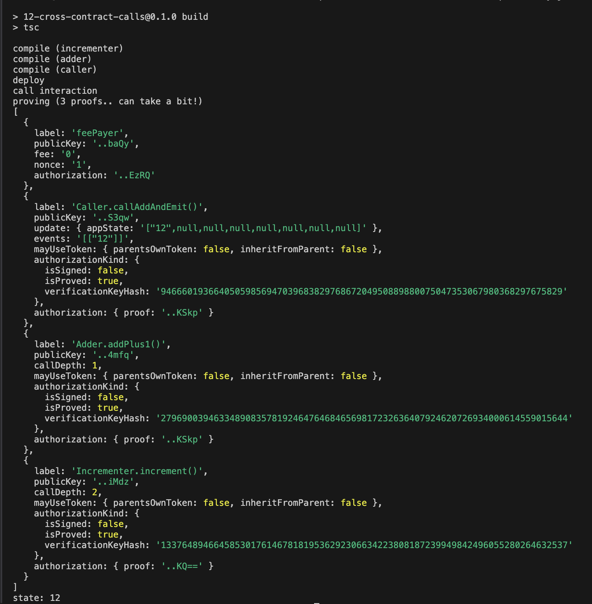

# Mina zkApp: 12 Cross Contract Calls

This Cross Contract Calls tutorial helps you learn how smart contracts on a blockchain can interact by calling functions in each other's code, enabling building modular and complex decentralized applications.

## Version
- o1js: **0.16.2**

## Tutorial

For the step-by-step tutorial, see [Tutorial 12: Cross Contract Calls](https://docs.minaprotocol.com/zkapps/tutorials/cross-contract-calls).

## How to install and run this example project

1. Clone the repository:
    ```sh
    git clone https://github.com/o1-labs/docs2.git
    ```
2. Change directory to the project location:
    ```sh
    cd docs2/examples/zkapps/12-cross-contract-calls
    ```
3. Install dependencies:
    ```sh
    npm install
    ```

4. Build the project:
    ```sh
    npm run build
    ```

5. Run the compiled code:
    ```sh
    node build/src/composability.js
    ```
    To run and build the compiled code with a single command:
    ```sh
    npm run build && node build/src/composability.js
    ```

## Expected output


## Last audit date
 
**27-February-2024**

## License

[Apache-2.0](LICENSE)
